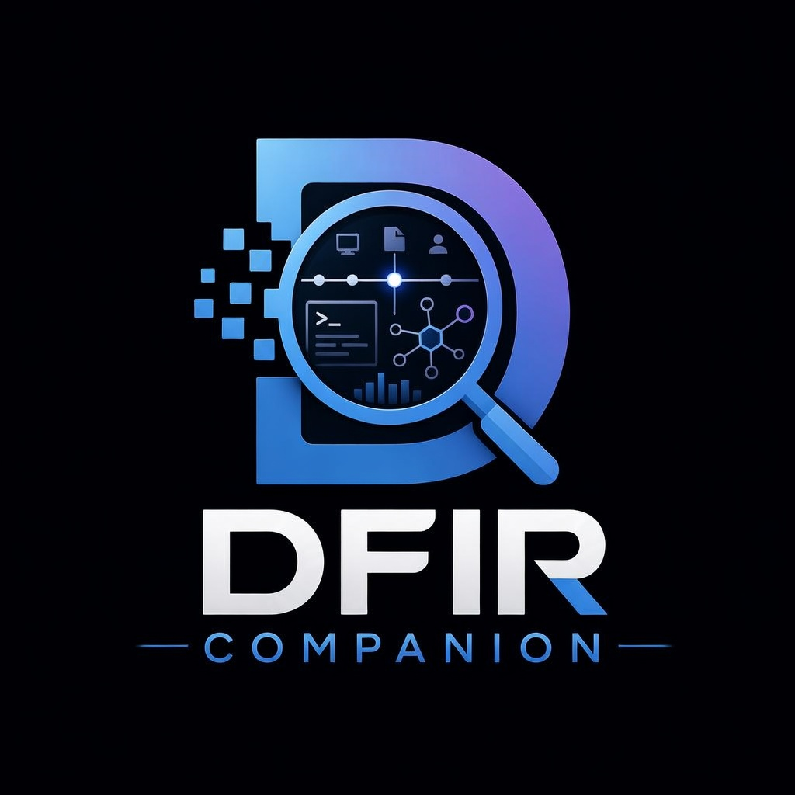
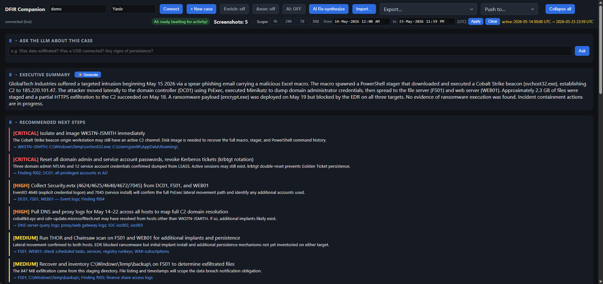
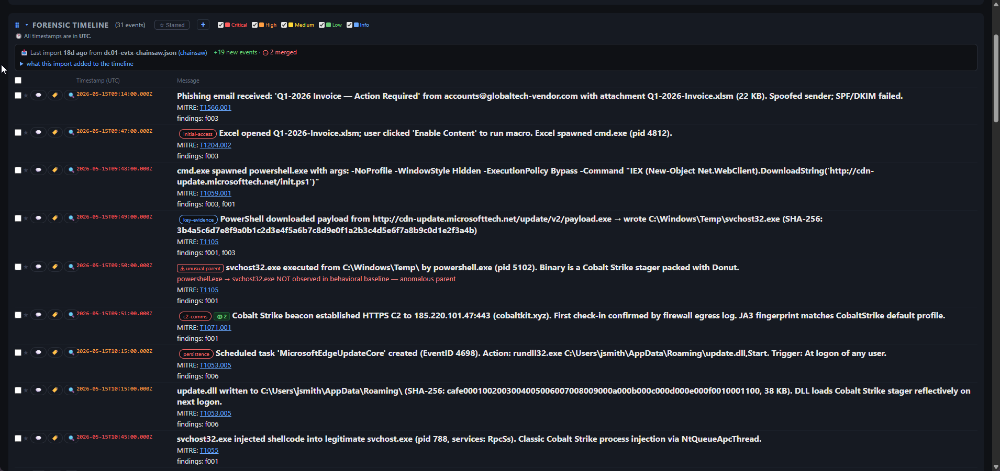
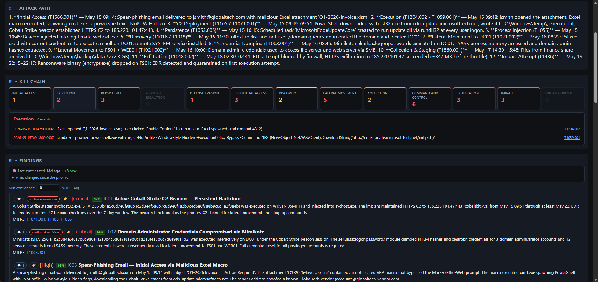
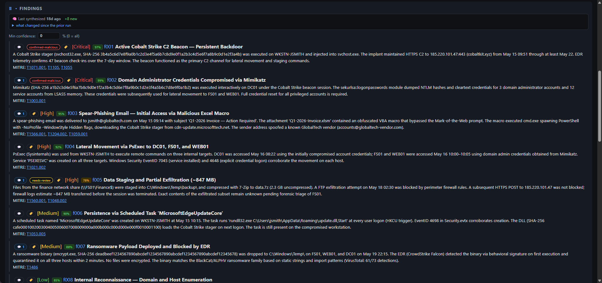
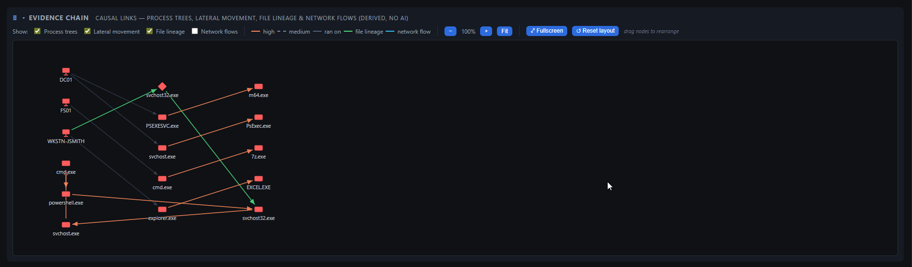
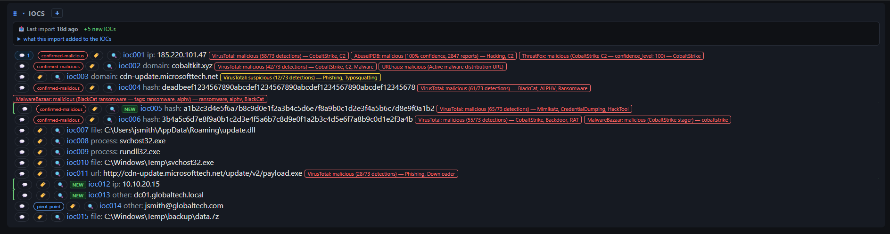
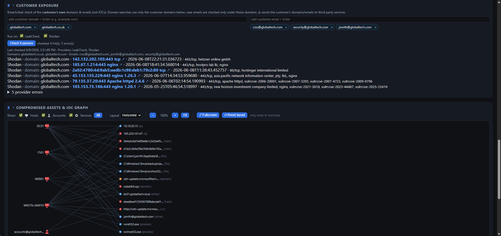
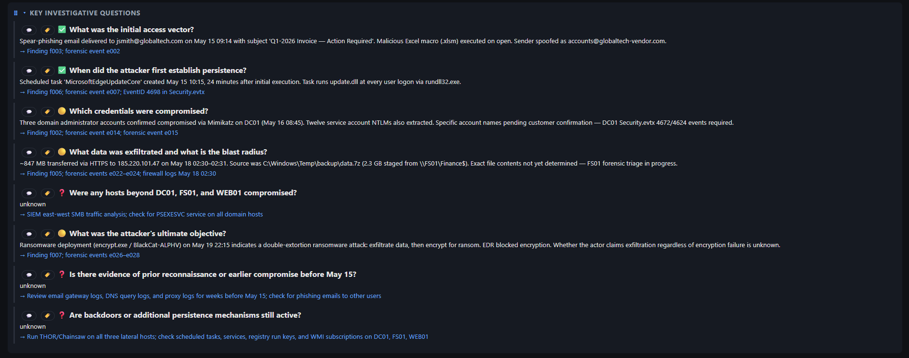

<p align="center">
  
</p>

# DFIR Companion

[](LICENSE)

> **AI-assisted DFIR triage — on your machine.** Turns investigation screenshots and imported
> artifacts into a forensic timeline, findings, IOCs, an asset↔IoC graph, and shareable reports;
> ask the case questions in plain English and collaborate with other investigators.

A localhost digital-forensics / incident-response companion. A browser extension
captures screenshots of your investigation (Velociraptor, EDR/SIEM dashboards, Security Onion, Splunk4DFIR, VolWeb, VirusTotal, etc.) as
evidence; a local server stores them, runs **windowed AI vision analysis** into an
accumulating per-case investigation state, and serves a **live dashboard** plus
exportable reports.

Everything runs on your machine — the companion binds to `127.0.0.1` only, evidence
stays on disk, and the AI provider is yours to choose.

> **Post-detection analysis layer.** DFIR Companion is NOT a detection engine — it ingests verdicts
> from **Velociraptor, Security Onion, Chainsaw, Hayabusa, THOR, Cyber Triage, EDR/SIEM**,
> correlates them into one forensic timeline, and synthesizes findings, attacker path, IOCs, and reports.
> The value is **"so what"**, not re-deriving alerts.
>

Demo Case: https://dfir-companion-production.up.railway.app/dashboard?caseId=demo
 
Hands-on lab: https://killercoda.com/dfir-companion/scenario/killercoda

User Manual: https://hasamba.github.io/DFIR-Companion/manual/

## Table of contents

- [Quick start](#quick-start)
- [Docker / Docker Compose](#docker--docker-compose)
- [Windows (Chocolatey)](#windows-chocolatey)
- [Linux (AppImage)](#linux-appimage)
- [Screenshots](#screenshots)
- [What it produces](#what-it-produces)
- [Features](#features)
- [Repository layout](#repository-layout)
- [How the pieces fit](#how-the-pieces-fit)
- [Environment variables (`companion/.env`)](#environment-variables-companionenv)
- [npm scripts — full CLI reference](#npm-scripts--full-cli-reference)
- [Recommended workflows](#recommended-workflows)
- [Roadmap](#roadmap)
- [Tests](#tests)
- [Disclaimer](#disclaimer)
- [License](#license)

## Screenshots

> **Demo case: GlobalTech Industries — BEC & Ransomware Precursor, May 2026.**
>
> A fully pre-populated case you can explore without importing any real evidence — findings, IOCs,
> MITRE techniques, analyst tags/comments, customer exposure data, and report metadata are all
> pre-seeded so every dashboard panel has something to show.
>
> **Load it in one click** — click the **Demo case** button in the dashboard toolbar. It works
> with the portable Windows EXE too (no Node or `npm` required). The button confirms before
> overwriting if the case already exists.
>
> **Or seed from the CLI** (dev / Docker):
> ```
> cd companion && npm run seed-demo              # creates case id "demo"
> npm run seed-demo -- --force                  # overwrite an existing demo case
> npm run seed-demo -- --case-id globaltech     # use a custom id
> ```
>
> Then open `http://127.0.0.1:4773/dashboard` and connect to the case.

---

### Executive Summary & Recommended Next Steps

AI-generated case summary and AI-prioritized remediation actions (Critical → Medium), each with
rationale and a pointer to the finding or artifact it came from.



---

### Forensic Timeline

events from Chainsaw · THOR · Suricata · severity filters, per-row
triage tags (`initial-access`, `c2-comms`, `key-evidence`, …), import change tracking
(+19 new events banner with expandable diff), and analyst star / bulk-action controls.



---

### Attack Path Narrative · MITRE ATT&CK Kill Chain · Findings

Full attacker-path write-up from initial access to ransomware attempt, an interactive kill chain
(click a tactic to expand its events), and the top findings with confidence scores.



---

### Findings

8 AI-generated findings (2 Critical · 2 High · 2 Medium · 1 Low) — each with a confidence %,
analyst triage tags, MITRE technique links, and a synthesis freshness diff.



---

### Evidence Chain Graph

Process trees + lateral movement stitched into one causal
attack graph. Derived deterministically from importer-populated fields — no AI, no cost, runs offline.



---

### IOCs with Threat-Intel Enrichments

indicators (IPs · domains · hashes · files · processes · URL) enriched against VirusTotal,
AbuseIPDB, ThreatFox, URLhaus, and MalwareBazaar — verdict badges, detection scores, `NEW` import
highlights, and analyst `confirmed-malicious` / `pivot-point` triage labels.



---

### Customer Exposure & Compromised Assets · IoC Graph

**Customer Exposure** (top): credential-leak check for the victim org's own domains and emails
against HIBP / DeHashed / Shodan — breach names, exposed services, no raw passwords stored.
**Compromised Assets & IoC graph** (bottom): interactive graph linking victim hosts and accounts
to the indicators that touched each — Host / Account toggles, fullscreen, drag-to-pin nodes.



---

### Key Investigative Questions

Standard DFIR questions auto-answered from the synthesized case
(answered ✅ / partial 🟡 / unknown ❓), each with an evidence pointer or a "collect this next" directive.



---

## What it produces

- **Forensic timeline** — real events with timestamps from artifacts, sortable/filterable by date/severity/source
- **Findings** — per-technique analytic conclusions with severity + MITRE ATT&CK mapping
- **Pinned findings** — pin the key findings (📌) to a sticky strip at the top of the Findings panel; drag-to-reorder, one-click jump, capped shortlist, persisted per case (travels in the case archive export)
- **IOCs, MITRE coverage, attacker-path narrative** — cross-source corroboration badges + kill chain
- **Inline IOC quick-actions** — click any detected value (IP/hash/domain/**SID**/URL/path) in an event row or an IOC value for a one-click tray: copy, mark benign, mark confirmed-malicious, suggest hunt — each outcome recorded to the investigation log
- **Attack phases** — timeline grouped into activity bursts by time gap, labeled by dominant tactic (deterministic, no AI)
- **Beacon/C2 candidates** — outbound channels with regular inter-arrival intervals (a hunting lead, not proof)
- **Timeline anomalies** — per-asset event-rate spikes, two baselines: **peer** (an asset far busier than other assets in the same bucket) and **self** (an asset bursting above its own typical rate — catches a normally-quiet host that bursts, which broad telemetry can't mask); ranked Critical/High/Medium, linked to timeline events (deterministic, no AI)
- **Log gap analysis** — suspicious silent periods in the timeline, flagged by density + working-hours rules
- **Gap hypotheses & shadow artifacts** — AI-proposed attacker actions during silent windows + Velociraptor collections to reconstruct missing time
- **Memory-forensics "Next-Step"** — on Volatility 3/Rekall import, spot anomalies (mis-parented procs, injected memory, encoded commands) and propose the next analysis step
- **Adversary hints** — MITRE ATT&CK groups ranked by technique overlap (offline dataset, sub-technique-aware; hypothesis fuel, not attribution)
- **Adversary emulation** — likely next techniques: the matched groups' named tradecraft the case hasn't observed yet, ranked by distinctiveness as hunt priorities, each with a one-click "hunt this" → Velociraptor VQL
- **Mitigations & defensive countermeasures** — concrete **MITRE ATT&CK Mitigations** (M-codes) for the case's techniques, ranked by leverage (which one mitigation covers the most techniques), plus **MITRE D3FEND** hardening/detection/isolation steps; offline, no AI. Bridges "what the attacker did" to "what to actually do about it." A **✨ Generate remediation plan** button turns it into a concrete, incident-specific IR plan (one AI call)
- **Compromised assets** — victim hosts/accounts + interactive asset↔IOC graph
- **Host & account ranking** — which hosts/accounts carry the attack, scored by signal (severity-weighted events + techniques + connective IOCs) not volume, with a one-click suggested scope window; click a ranked row to expand the events/IOCs behind its score inline (capped at 50 each) and jump straight to a cited event in the timeline
- **Key investigative questions** — answered with pointers to evidence or next steps to collect
- **Investigation threads** — open/resolved leads
- **Dashboard view presets** — one-click Analyst/Lead/Executive (role) + Triage/Report/Deep-Dive/Hunt-Prep (phase) layouts that re-arrange panels, filter by severity, and pair a report template; per-case, fully editable. **Analyst** is the default for any case with no saved per-case choice; explicitly picking Custom still sticks across reloads
- **Reports** — Markdown, HTML, PDF, Word (.docx), CSVs, JSON exports

## Features

### Onboarding
- **Setup wizard** — guided multi-step dashboard overlay (auto-shown first-run; also in Settings → General / AI) to configure AI (extraction **and** synthesis model, separately), the integrations (Velociraptor, DFIR-IRIS, Timesketch, Notion, ClickUp), threat-intel enrichment + customer-exposure providers, push ingest, NSRL, and a notification webhook (Slack/Teams/Mattermost/Discord) — each with Save → apply-live → connection/status test, and a ✓/○ progress rail. Everything is optional and dismissible

### Capture & ingest
- **MV3 browser extension** — timer + event-driven capture (navigation/tab/click), `Ctrl+Shift+S` hotkey, offline queue + auto-sync, per-case Start/Stop
- **One-click artifact push** — Splunk/Velociraptor/Kibana/Security Onion/SO-CRATES/CrowdStrike/VolWeb injects **Push to DFIR-Companion** button; intercepts API JSON or scrapes table; the popup shows the auto-detected console with a dropdown to force a different adapter (or none) per tab
- **Right-click "Send to DFIR-Companion"** — send a page's selected text, a nearby table, or a link's URL straight to the connected case from any page, not just recognized consoles
- **Case management** — **+ New case** in dashboard (templates auto-load incident questions + import hints); captures to unknown case rejected
- **Case password protection** — set a password on a case (🔒 Password… in the case lifecycle menu) so opening it in the dashboard requires that password; a "remember on this computer" option skips the prompt on future visits from the same browser. Enforced server-side (an unlock cookie gates every `/cases/:id/*` route) — the capture extension's evidence ingestion keeps working while a case is locked
- **Permanently delete a case** — 🗑️ Delete… in the case lifecycle menu removes a case's directory for good, with an optional ZIP/encrypted archive taken first; refuses to touch a directory that isn't a real case and won't delete an already-archived case's live folder out from under its archive
- **Import screenshots** — multi-select PNG/JPEG/WebP; single **Import** button auto-detects artifact format (CSV/JSON/log)
- **Evidence drop folder** — each case has a `drop/` folder; anything copied in (subfolders included) is auto-imported in the background via the same chain as the Import button (images → screenshot evidence), then moved to `_processed/` or `_failed/`; failures surface in a dashboard banner + notifications; every outcome (imported/failed/pending, with reason) is appended to a running `drop-log.txt` in the same folder
- **External tool runner** (Settings → Tools) — run your **own locally-installed** Hayabusa / Velociraptor CLI / Suricata / Snort / YARA against raw evidence the Companion can't parse (EVTX/PCAP/files), then ingest the tool's *output* through the existing importers. Configure the binary path + args per tool (never bundled/downloaded). Importing a raw EVTX/PCAP from the dashboard — or dropping raw files in a case's `drop/` folder — shows a header banner that **asks once per batch** before running (auto-run is opt-in per tool); each tool also has a one-click "update rules" button. **Add your own custom tools** too (name, binary, command, update command, extensions) — their output is auto-detected and routed to the right importer. No-shell argv, path-contained, runs from the tool's own dir, off by default
- **Import undo/redo** — roll back/forward to exact pre-import state (no re-synthesis); multi-level per-case stack
- **Custom (declarative) importers** — teach a new file format with a JSON definition (no code); LLM-authorable via a built-in prompt, auto-detected + imported like a built-in, with built-in/custom precedence
- **Evidence-first** — written to disk + audit log before analysis; SHA-256 dedup (disable via `DFIR_DEDUP=off`)
- **Screenshot OCR full-text search** — every captured screenshot is OCR'd locally in the background; search the text seen in consoles (hostname, "mimikatz", a hash, an error) from the filter bar and jump to the screenshot. No AI, local-only (`DFIR_OCR_SEARCH=off` to disable; `npm run ocr-index` to backfill)
- **Localhost only** — `127.0.0.1` with CORS + Private-Network-Access for extension

### Evidence importers

All importers are **deterministic (no AI call)**, read the artifact's own timestamps, and tag events with the real tool name for cross-source correlation. The same file can be re-imported without duplicating the timeline.

| Format | Key sources | Severity derived from |
|---|---|---|
| **SIEM / EDR JSON** | Elastic, Kibana, Splunk, QRadar, any JSON/NDJSON export | Windows/Sysmon per-EID table |
| **ECAR (EDR telemetry)** | EDR Common Activity Record NDJSON (`object`/`action`/`properties`, epoch-ms `timestamp_ms`) — process/flow/logon/registry/module/file/thread events | Info evidence; LOLBin/encoded command-line bump (public IPs → IOCs) |
| **Windows Event Log XML** | Event Viewer "Save As XML", `wevtutil qe /f:xml`, `Get-WinEvent … ToXml()` (Security, Sysmon, System, any channel) | Windows/Sysmon per-EID table |
| **Chainsaw** | EVTX hunt JSON/JSONL (`chainsaw hunt --json`) | Matched Sigma rule level |
| **Hayabusa** | `json-timeline` or `csv-timeline` | Matched Sigma rule level |
| **Velociraptor** | JSON array, JSONL, or artifact map | Sigma/YARA verdict or per-EID |
| **THOR (Nextron)** | JSON-Lines scan output | THOR alert level |
| **Suricata / Zeek** | `eve.json`, Zeek JSON logs; telemetry → IOCs only | Alert priority / notice severity |
| **Snort / Suricata IDS (fast)** | `alert_fast` single-line alert log | Rule **Priority** (1→High / 2→Medium / 3→Low) |
| **YARA** | `yara -s -m` CLI scan output (rule matches + strings/meta) | Info→Medium per match; bump on rule `score`/`threat_level` meta |
| **Web/proxy access log** | Apache/Nginx/Squid **combined** log format (web server or forward-proxy access log); request URL, **HTTP Referer, and User-Agent** captured (secrets in URL/Referer + scanner/bot/injection UAs survive as events + IOCs) | Info by default; access-denied (401/403/407) → Low; git smart-HTTP clone/push → T1213 |
| **Cisco ASA firewall syslog** | `%ASA-#-######:` Built/Teardown/Deny messages | Info by default (telemetry); explicit **Deny** → Low |
| **Syslog (plain)** | RFC 5424 (`<PRI>1 …`) + RFC 3164 (`Mmm dd …`) Linux/Unix host logs | Info by default (telemetry); auth-failure or crit/alert/emerg PRI → Low |
| **Security Onion** | SOC Alerts/Hunt events (ECS); pushed by the extension or a SOC API export | `event.severity_label` (Suricata/SO label) |
| **SO-CRATES** | Suricata alerts + YARA file matches (`/api/events`) and Sigma detections (`/api/sigma-alerts`); pushed by the extension or a raw export | Suricata priority / Sigma level / YARA match |
| **Cyber Triage** | JSONL / JSON / CSV timeline | Cyber Triage item score |
| **M365 / Entra ID** | UAL, Entra sign-in + audit logs | BEC tradecraft table / Entra riskLevel |
| **AWS CloudTrail** | Records JSON, NDJSON, Athena | API action table (IAM/logging/S3/secrets) |
| **GCP / Azure** | Cloud Audit Logs, Azure Activity Log | Action table (IAM/logging/secrets) |
| **Kubernetes audit** | API-server audit log (`audit.k8s.io` JSON-lines / EventList) | (verb, resource) table — pod exec/attach T1609, secret access T1552.007, RBAC change T1098, privileged-pod T1610/T1611, anonymous access T1078 |
| **osquery** | scheduled-query result log (differential `columns` + `snapshot`) | Info telemetry; conservative tradecraft bump on a command-line column |
| **Plaso** | `psort` CSV (dynamic + l2tcsv) | — (Info events) |
| **Sandbox reports** | CAPEv2 `report.json`, Falcon Sandbox summary | Sample verdict + behavioural signatures |
| **Memory forensics** | Volatility 3 (`-r json`) + Rekall: pslist/pstree, netscan, malfind, cmdline, svcscan | malfind injected code → High (T1055); listings → Info/Low evidence |
| **TheHive** | Case / alert JSON export, observable list (TheHive 5) | TheHive severity 1–4; MITRE from ATT&CK-tagged tags |
| **Email** | `.eml` (RFC 2822), best-effort `.msg` | SPF/DKIM/DMARC fail → sender spoof heuristics (T1566 Phishing) |
| **Shell history** | `.bash_history` / `.zsh_history` (bash `HISTTIMEFORMAT` `#epoch` + zsh extended history) | Info by default; conservative bump on tradecraft (reverse shell, download-and-exec, cred access, log/history tampering, lateral SSH) |
| **Linux auditd** | raw `audit.log` / `ausearch` records, `aureport` tables | Record-type table (logins, account mgmt, sudo, SELinux, audit tampering) |
| **systemd journald** | `journalctl -o json` / `-o json-pretty` | syslog PRIORITY + tradecraft bumps (sshd, sudo, useradd) |
| **sysdig / Falco** | Falco alert JSON, sysdig `-j` event JSON | Falco rule priority; raw syscalls → Info telemetry |
| **Wazuh** | `alerts.json` / NDJSON, or API export (`GET /security/events`) | `rule.level` (≥13 Critical, ≥10 High, ≥7 Medium) |
| **CSV** | Velociraptor / EDR exports | — |
| **Generic logs** | Firewall, syslog, VPN; repetitive lines → counted patterns | AI-triaged |

**Deterministic tradecraft grading** — across the Windows/Sysmon, ECAR and memory importers, process command lines are graded against a rule set harvested from over 110 real intrusions (The DFIR Report, 2020–2026, and Huntress "Rapid Response" reports): high-confidence tradecraft → **High** with the correct ATT&CK technique (Defender/AV disable incl. registry `Start=4`/`SystemSettingsAdminFlows.exe` T1562.001, recovery inhibition T1490, LSA/UAC tampering T1112/T1548.002, credential dumping `dcsync`/`secretsdump`/`lsassy`/`reg save …\security`/NTDS-via-`wbadmin backup`/browser-credential-file copy T1003.x/T1555.003, reverse-tunnel C2 `ssh -R`/plink/QEMU-SSH-backdoor T1572, Impacket lateral movement T1047/T1021.002, malicious service creation T1543.003, hidden accounts T1564.002, privileged-group additions T1098.007, Linux `chattr +i` T1222.002, bulk EventLog wipe via `.NET EventLogSession` T1070.001, silent remote MSI install T1218.007, `curl|bash` fetch-execute T1059.004, cloud exfil rclone/restic/Elastic-ingest T1567.002/T1041, RMM/C2 tooling T1219/T1071), dual-use → **Medium**; pure host/domain discovery (nltest trusts, AdFind/BloodHound, scanners, AV/share enum) is tagged but never escalated, so the enumeration phase shows in the MITRE table without false findings.

- **SSH brute-force-success detection** (T1110.001) — flags a successful login following a burst of failed attempts from the same source IP → Medium
- **Windows logon-type risk grading** — decodes 4624 logon types and grades risky shapes (external RDP, network-cleartext, `runas /netonly`) → Medium
- **NTFS timestomp detection** (T1070.006) — flags MFT `$SI`/`$FN` timestamp mismatches as likely timestomping → Medium

### AI analysis
- **Guided AI setup** — the Setup wizard's first step picks provider → model (cheap/strong suggestions) → key → optional base URL, then runs a live connectivity test before you leave
- **Two-phase** — cheap per-window vision (extraction) + strong text-only synthesis (findings/IOCs/MITRE/attacker path)
- **Providers** — OpenAI, OpenRouter, Ollama, LiteLLM, Gemini; optional two-tier (cheap extract + strong synth) with context budgeting
- **EDR/SIEM consoles as evidence** — detections extracted; analyst navigation filtered (real detections never dropped)
- **Severity-aware findings** — Critical/High rows become findings; deterministic auto-creation for missed high-severity events
- **Confidence scoring + reasoning** — every finding carries a 0–100% confidence (weighing evidence strength, tool corroboration, and model certainty) plus a one-line reason; a persistent per-case min-confidence filter (survives reload) hides low-confidence findings on demand
- **KEV / tool-confirmed / unconfirmed-lead badges** — flags whether a finding is corroborated by an actively-exploited CVE, a tool-graded detection, or only raw telemetry
- **Efficient synthesis** — live debounced re-synthesis; skip-if-unchanged; stratified event selection + asset↔IOC digest
- **Synthesis coverage audit** — the synth-meta card shows how many in-window events a run considered vs. omitted, and why
- **Second LLM opinion** — on-demand QA: different model re-synthesizes case, reconciles disagreements (per-item accept/reject); durable across re-synthesis
- **AI-assisted content-tagger rules** — describe a rule in plain English; AI drafts, previews, and adds it
- **AI-input anonymization** — reversibly tokenizes IPs/users/hosts/domains/emails/paths, PowerShell encoded-command blobs, and victim SIDs; one-way-redacts secrets (adversary IOCs preserved)

### Correlation & deduplication
- **Cross-source correlation** — the same artifact seen by different tools collapses into one corroborated event (shared hash / same path in a time window / exact duplicate), tagged with the real tool names. Idempotent — re-importing never doubles the timeline.
- **Cross-tool command-line correlation** — merges same process-creation events reported by different tools that share a command line, parent process, and host
- **Corroboration filter (lens)** — a per-section control in each title bar (Timeline / IOCs / Findings) to show only items observed by **2+ or 3+ distinct tools**, so single-source background noise (internet scanners, benign telemetry) drops away and the multi-source attack path stands out. Each section's lens is independent. A *lens, not a gate* — nothing is removed from state; set back to *any* to see single-source evidence again. Per-browser.
- **Per-source noise/trust scores** — weights sources by reliability for correlation wording and confidence capping; overridable per case

### Investigation workflow
- **Cited AI answers** — findings, Ask-the-case, Explain Event, and AI-suggested hunts (playbook + fleet) show numbered, clickable citations to the supporting forensic events/findings, in both the dashboard and the exported report
- **Explain This Event** — 💡 per-row AI button explains any forensic event in context: what happened, why it matters, normal-vs-suspicious, ATT&CK mapping, 1–3 runnable pivot queries (VQL/KQL/SPL), evidence for/against; ephemeral overlay
- **Ask the case (GraphRAG)** — free-form Q&A grounded in timeline + deterministic evidence-chain graph; multi-hop questions answered via real relationships
- **Hypothesis-driven mode** — status-tracked hypotheses (open/supported/refuted/unknown), auto-generated + analyst-authored, with evidence/technique links + a report section; open ones steer synthesis, notebook notes promote in, survive synthesis + case archive exports; ACH-style ranking tracks contradicting evidence, a discriminator, and hunt-exhaustion so a red herring can't win unopposed
- **On-demand hypothesis falsification review** — a "Review" button runs a focused for/against pass over open hypotheses without re-running full synthesis
- **Case memory** — synthesis logs each run to a durable, never-wiped Investigation Log; a *known unknowns* block (timeline gaps, uncovered ATT&CK phases, lookalike actors' next techniques) grounds synthesis + hunt suggestions; opt-in candidate-actor hypotheses (`DFIR_SYNTH_ADVERSARY_HINTS`)
- **Structured, deployable collection directives** — "collect X" recommendations carry a machine-actionable target; one-click deploy on a known host, with auto-detected import satisfaction
- **Evidence Gaps panel** — uncovered kill-chain phases render as structured items with a deployable collection directive, in a dashboard panel and report §4.6.2
- **Zero-yield import warnings** — flags a large AI-triaged file that produced zero events, on the import banner and Evidence Gaps panel
- **Second-look loop** — after synthesis, resolves open questions against the complete super-timeline and triggers one bounded re-synthesis
- **Immediate false-positive cascade** — marking a finding/IOC/event FP synchronously re-evaluates dependent questions, next-steps, and hypotheses
- **Rabbit-hole detection** — findings disconnected from the main evidence graph are demoted and badged "possible rabbit hole"
- **Per-case prevalence baseline + FP-pattern propagation** — rarity-biased event selection, plus one-click bulk-dismiss for events matching an already-dismissed FP pattern
- **Learn from dismissed findings** — repeated FP patterns lower (not zero) confidence on similar new activity
- **Content-based event tagger** (Timesketch-style `tags.yaml`) — rule engine tags events, raises severity, and unions MITRE techniques
- **Response Playbook** — trackable checklist (status/priority/assignee/due/custom tasks); opt-in IR-templates expand findings into Contain→Investigate→Eradicate→Recover
- **Triage tags & comments** — label entities + attach notes; live WebSocket sync; survive synthesis
- **Activity log** — a chronological, filterable record of every security-relevant action taken on a case (imports, mark/unmark false-positive, AI runs, enrichment/anonymization toggles, settings changes, playbook edits, comments/tags, hunt runs, exports)
- **Bulk actions** — multi-select events/IOCs/findings: star/tag/mark-false-positive/enrich/copy
- **IOC whitelist** (Settings) — CIDR/exact/regex patterns auto-mark matching IOCs false-positive; global; opt-in
- **Per-case IOC exclude list** — permanently remove domain/hostname (or any IOC type) matches from a case via exact/suffix/regex rules in the IOCs panel title bar; excluded values are purged immediately and never re-imported or enriched
- **NSRL known-good hashes** (Settings) — flat hash set or direct SQLite DB query (~160 GB); auto-marks matching events/IOCs false-positive
- **Payload deobfuscation** — auto-decodes base64 PowerShell (`-enc`, `[Convert]::FromBase64String`); extracts hidden IOCs; shows [Decoded] blocks
- **CISA KEV integration** (Settings) — cross-reference CVEs against CISA catalog; strong initial-access signal
- **Composite IOC risk score** — weighted critical/high/medium/low/benign tier per indicator, shown as a badge, filter lens, and report column
- **IOC corroboration** — ⊕ N badge shows how many tools observed each indicator
- **IOC provenance** — each IOC classed detection-linked (seen in a Low+ event) vs telemetry-only (Info only), distinct from the threat-intel verdict; per-IOC badge + All/Detection-linked/Telemetry-only filter
- **IOC provenance chain** — per-IOC 🔗 panel showing extraction event(s), enrichment lookups, and citing findings, each timestamped, with a JSON export. For the Security Onion, combined-log, network, and Velociraptor importers the extraction event is the exact source row that produced the IOC — shown as "linked" (vs "approximate" elsewhere); AI synthesis can't forge this link
- **IOC flagged-only filter** — hide everything except threat-intel-confirmed indicators
- **IOC type filter** — faceted dropdown (ip/domain/url/hash/file/process/other) with per-type counts; composes with the flagged-only + search filters
- **IOC list noise-reduction controls** — three composable display-only filters, default on: hide false-positive/no-intel IOCs, hide OS system-path files, and a "🎯 Signal only" narrow-to-flagged/corroborated/enriched view
- **IOC list pagination** — pages client-side like the timelines, default 100/page
- **Exclude filter** — chip-list control (beside the toolbar search) hides timeline events / IOCs / findings matching any of several exclude terms; per-browser
- **Hunt-pivot generator** — one-click emits Velociraptor VQL, KQL, ES|QL, SPL, Sigma, YARA, Suricata queries
- **Query Translator** — plain English → runnable queries (NL: "PowerShell downloading then executing") across all enabled platforms; one-click-deploy VQL hunts
- **Velociraptor triage bundles** — browse artifacts → save bundles → run as hunts (label/OS/min-severity, relative hunt expiry 1h/1d/1w, default 1h) → auto-collect + import, with live hunt-status polling (a deleted hunt is reflected on the dashboard within 30s, and results auto-collect as soon as the hunt finishes)
- **AI-suggested fleet hunts** — AI proposes proactive fleet-sweep hunts grounded in the causal evidence graph (spawn chains, file lineage, lateral movement), so hunts target the relationship, not just the leaf indicator
- **AI-suggested playbook hunts** — AI proposes hunts per endpoint-related task (single-endpoint collection or fleet hunt)
- **Hunting feedback loop** — records each deployed hunt's outcome (new evidence + counts) per case; suggestions skip an already-run query and pivot on what hit, with a *Hunting Profile* of hunted/hit/missed
- **Webhook push ingest** (opt-in, token) — external tools push alerts via `POST /cases/:id/push` (SIEM webhook, Velociraptor monitor, scripts)
- **Velociraptor live monitoring** (opt-in) — stream CLIENT_EVENT artifacts (e.g., ProcessCreation) as events fire; auto-collect on interval; one-click auto-monitor for all enabled artifacts
- **Import an external hunt/flow** — pull results from a Velociraptor hunt or collection launched in the Velociraptor GUI (paste a hunt id / flow / GUI URL); a flow's host is resolved automatically and events attributed to it, with an optional super-timeline-only route. For upload-only artifacts (THOR/Hayabusa reports, no result rows), paste the GUI's **Uploaded Files** tab URL instead to import just the uploaded report; the upload reader also picks up `.csv`/`.txt`/`.log`/`.jsonl` files, not just `.json`
- **Scope + false-positive marking** — set time window; mark findings/IOCs/events false-positive with a structured reason (known-good tool/authorized test/detection misfire/duplicate/other) + analyst attribution (reversible); all views re-project
- **False-positive similarity suggestions** — mark one item false-positive and get ranked "similar items" candidates (shared MITRE/process/hash/asset/IOCs), deterministic or AI-assisted, to dismiss the same pattern in one pass; single-IOC marks can also one-click-promote to the global IOC whitelist
- **Super-Timeline** — a Timesketch-style complete record of *every* imported event, kept in a separate per-case store the AI never synthesizes (so the forensic timeline stays detections-focused). Filter by time / origin (e.g. hide Sigma/YARA/Hayabusa detections to see only raw host artifacts) / label, save named timeframes, and label events; **promote** selected events into the forensic timeline so AI synthesis picks them up. A "Super-Timeline Triage" Velociraptor bundle collects raw Windows host artifacts (MFT, USN, EVTX, registry, Prefetch, Amcache, LNK, browser history, RecycleBin, scheduled tasks, ActivitiesCache) into the super-timeline only
- **Severity-gated forensic timeline** — Info telemetry routes to the super-timeline only (the forensic timeline keeps Low+ graded signal) so synthesis isn't swamped; configurable via `DFIR_FORENSIC_MIN_SEVERITY` + a per-case override, promotion bypasses the gate, and IOCs are still extracted from every event
- **Freshness** — "last synthesized N ago" + diff (duration/event/IOC counts); "last import N ago" + NEW row highlights; ⚠ advisory for cases >5 000 events
- **Timeline event-density heatmap** — a bar strip above the Forensic Timeline buckets the full filtered dataset (every page, not just the current one) by time, colored by each bucket's worst severity; click a bar to zoom the timeline to that window; collapses to a thin sparkline on mobile
- **Timeline pagination** — 100/250/500/all rows per page (user-selectable); prev/next controls
- **Timeline source filter** — faceted dropdown (beside the severity legend) to show/hide events by the tool/source that produced them; multi-source events stay visible unless every source is hidden
- **Timeline origins filter** — one level more specific than the source filter: shows/hides events by the exact artifact that produced them (e.g. `DetectRaptor.Windows.Detection.MFT`), on both the forensic and super timelines
- **Timeline row display** — Settings → General toggles which sub-elements each timeline row shows (action icons / tag pills / badges / host chip / MITRE / related findings / evidence links); timestamp + message always shown; per-browser, applies immediately
- **Vim-style keyboard navigation** — `j`/`k` moves a focused-row highlight on the Forensic Timeline, `f` stars, `i` prefills the manual IOC form, `p` pins the cited finding, `n` opens a comment, `?` shows a cheat sheet; toggleable in Settings → General, default on
- **Remember import severity** — the minimum-severity import prompt has a *don't ask again* checkbox that saves the chosen floor and skips the prompt on future imports; manage/clear it in Settings → General → Import severity; per-browser
- **Correlation profile** — per-case Strict/Moderate/Aggressive/Custom window for cross-source event merging; toolbar dropdown + `PUT /cases/:id/correlation-profile`

### Threat-intel enrichment (off by default — opt-in per case)
- **Sources** — VirusTotal, Hunting.ch (MalwareBazaar/ThreatFox/URLhaus/YARAify), CrowdStrike Falcon TI, AbuseIPDB, MISP, YETI, OpenCTI, RockyRaccoon (process prevalence + anomalous parent/child), CIRCL hashlookup (keyless known-file / known-good hash lookup — cuts false positives)
- **Lookalike / typosquat domain detection** — offline provider flags domains impersonating common brands (T1566/T1583.001); on by default
- **IP infrastructure** — Reverse DNS (PTR hostnames), WHOIS over RDAP (netblock/ASN/abuse-contact), GeoIP (country/city/ASN/org), Shodan host (hosted domains/ports/services/CVEs); the "where from / who owns it / what's hosted" context layer — Reverse DNS/WHOIS/GeoIP are keyless, Shodan reuses `DFIR_SHODAN_KEY`
- **Local vs external** — MISP/YETI/OpenCTI on-box; third-party SaaS opt-in per case; enabling source re-checks all existing IOCs
- **Reachability gate** — health-probe self-hosted instances; auto-resume when online

### Customer exposure (separate from IOC enrichment)
- **Victim org assets only** — HIBP, LeakCheck, DeHashed (email breaches), Shodan (exposed hosts/ports/CVEs); per-provider opt-in
- **OPSEC boundary** — only analyst-entered domains queried; adversary/IOC domains never sent; raw passwords never stored

### Dashboard & reports
- **Live dashboard** over WebSocket — collapsible, drag-to-reorder sections, scope bar, clickable evidence links, badges
- **Background jobs** — a toolbar badge/popover tracks running imports, synthesis, and enrichment (`/api/jobs`); Cancel hard-aborts a long/stuck run; large imports stream live progress instead of appearing frozen
- **Dark/light theme** — toggle or OS preference
- **Forensic timeline rows** — affected host + clickable finding links; report has Host column
- **Manual add** — record missed events/IOCs (tagged `manual`, survives re-analysis)
- **MITRE techniques** link to [attack.mitre.org](https://attack.mitre.org/)
- **Asset ↔ IoC graph** — interactive (Host/Account/Service toggles, zoom, fullscreen)
- **Evidence Chain graph** — process trees + lateral movement across hosts
- **Login graph** — Timesketch-style interactive account→host logon graph (4624/4625) with layout switching, risk-colored edges and drill-down to events
- **Timeline Swimlane** — severity/tactic × time; click details, Shift-select for bulk action, PNG export
- **Reports** — Markdown + HTML + PDF (one-click) + Word (.docx) + CSVs (findings/IOCs/timeline) + JSON state
- **ATT&CK Navigator layer** — techniques colored by severity; upload to [Navigator](https://mitre-attack.github.io/attack-navigator/)
- **STIX 2.1 bundle** — for OpenCTI, MISP, Anomali, etc.
- **IOC block-list** — TXT/CSV/STIX-only; filters by severity/type/verdict
- **Automatic state backup / rotation** — pre-synthesis + hourly snapshots of all per-case state files; configurable retention; Settings → Diagnostics → restore with one click
- **Encrypted case archive** — password-protected .dfircase export of the ENTIRE case (evidence and screenshots included, AES-256-GCM encrypted); cross-machine sharing + restore as new case
- **Redacted case package** — ZIP with tokenized IPs/hosts/users, blurred PII in screenshots, adversary indicators preserved
- **AI executive summary** — management-facing (no ATT&CK ids/hashes/tool names)
- **Narrative Timeline** — prose story for non-technical stakeholders
- **DFIR-IRIS push** — idempotent; maps assets/IOCs/timeline/tasks; the push dialog shows (and lets you override) the target IRIS case name, remembered so later pushes keep hitting the same case. **Settings → DFIR-IRIS** has Test/reconnect (no restart)
- **DFIR-IRIS import** — pull existing case assets/IOCs/timeline (deterministic, no AI)
- **Timesketch push** — find-or-create sketch; push or download either the Forensic Timeline or the full Super Timeline (raw host-triage artifacts included), each into its own timeline within the same sketch so neither clobbers the other; export JSONL
- **Notion export** — managed page block; your notes outside it untouched
- **ClickUp export** — Response Playbook as tasks; re-push updates in place
- **Notifications** — Slack/MS Teams/Mattermost/Discord/Telegram/SMTP for findings/playbook/milestones; per-channel threshold + toggles
- **Report templates** — global branded layouts (accent, header/footer, section order); pick per case. A section disabled here skips its AI generation (executive summary, narrative) to save tokens (#168)
- **Mobile companion** — read-only PWA (`/mobile`) for findings/timeline/IOCs with verdicts; offline app-shell
- **Presentation / timeline-replay mode** — read-only, step-through slide deck (`/cases/:id/present`) for handoff briefings & executive walkthroughs: big cards, keyboard nav, auto-advance, severity filter, report-template branding; export a self-contained offline HTML deck (#177)
- **🌍 Geographic IP map** — plot geo-located IP IOCs on an interactive Leaflet world map (severity colors, victim→attacker flows, country stats, filtering, CSV export); coordinates from the opt-in GeoIP enrichment, offline-friendly (tiles overridable)

### Ops
- **Health / Diagnostics** — **Settings → Diagnostics** one-page operator view: disk usage, case count, capture/synthesis queue, redacted AI config + live *Test AI connectivity*, importer attempts (24h/7d) + recent failures; compute-on-demand case sizes; key-free copy-to-clipboard
- **Case Statistics panel** — per-case totals, source breakdown, and import velocity in Diagnostics
- **Per-case AI cost tracking** — **Settings → Diagnostics** shows an "AI cost — this case" card: calls, dollar cost, and token counts by Vision/Synthesis/Other and by model, read from the provider's real per-call cost/token counts (never a fabricated `$0.00` when a provider doesn't report it)
- **Configurable event ingestion cap** (`DFIR_MAX_EVENTS`) — overrides the default 2000-event-per-import safety cap
- **Prompt regression / eval harness** — CI-safe and real-provider golden-output testing for AI extraction/synthesis quality
- **Logging** — console + global session log + per-case audit trail; `DFIR_LOG_LEVEL` live toggle; `debug` traces AI/captures/OCR/anonymization
- **Chrome extension** — install from the [Chrome Web Store](https://chromewebstore.google.com/detail/dfir-companion-%E2%80%94-evidence/jhlffkfnamlmfkijgpaopdnbmbajldmf); connects to the local server, no standalone function
- **Portable Windows EXE** — unzip + double-click, no Node required
- **Chocolatey package** — `choco install dfir-companion`; downloads + verifies the portable build + bundles the capture extension, data in `%LOCALAPPDATA%`
- **Docker / Compose** — `docker compose up`; evidence on host volume, no bundled AI backend
- **Linux AppImage** — single-file executable for any glibc distro, no Node required
- **Update notice** — opt-in (default off) check for a newer GitHub release; dashboard banner, never auto-downloads
- **Customizable prompts** — override prompts via env var or file; edits apply without restart
- **Demo case** — one-click load or `npm run seed-demo` to seed GlobalTech scenario
- **CLI scripts** — `reanalyze`, `synthesize`, `coverage`, `verify:ai`, `clean-timeline`

## Repository layout

```
52.43-DFIR-Companion/
├── companion/         Node/TS localhost server (the core). See companion/README.md.
├── extension/         Chrome/Comet MV3 capture extension. See extension/README.md.
├── public/
│   └── dashboard.html Live dashboard, served by the companion at /dashboard.
├── docs/
│   └── superpowers/plans/   The original 4 implementation plans.
├── Dockerfile         Single-image build (server + dashboard + add-on); no Ollama/LiteLLM.
├── docker-compose.yml Localhost-only Compose: ./cases volume, add-on → ./addon.
└── cases/             Evidence + state output (gitignored). Location set by DFIR_CASES_ROOT.
```

## How the pieces fit

```
 Browser (Comet/Chrome)                Localhost companion (127.0.0.1:4773)
 ┌─────────────────────┐  POST         ┌───────────────────────────────────────┐
 │ DFIR Capture (MV3)  │ /captures ──▶ │ ingest → evidence (screenshots+jsonl)  │
 │  timer + events     │               │   │                                    │
 └─────────────────────┘               │   ▼ per-window AI extraction (cheap)   │
                                        │ forensic timeline ──▶ synthesis (strong)│
 Dashboard / Reports ◀── WS /ws,       │   findings, IOCs, MITRE, attacker path, │
   GET /cases/:id/state                │   key questions, threads                │
 └─────────────────────┘               └───────────────────────────────────────┘
```

**Two-phase analysis:** a cheap vision model reads each screenshot into the forensic
timeline; a stronger model does the single holistic synthesis call (findings, MITRE,
attacker path, questions). Configure both via `.env` — see `companion/README.md`.

## Quick start

> **Prerequisite:** [Node.js](https://nodejs.org/) **20 or later** (which ships with `npm`).
> Check with `node --version`. Everything below uses `npm`, so no other runtime is needed.
> One optional feature — the **NSRL RDS SQLite backend** — needs **Node 22.5+** for the
> built-in `node:sqlite` module; everything else (including the flat NSRL hash list) runs on Node 20.

1. **Companion** (the server):

   ```
   git clone https://github.com/hasamba/DFIR-Companion.git
   cd DFIR-Companion/companion
   npm install
   cp .env.example .env      # set DFIR_AI_PROVIDER / MODEL / KEY (or leave AI off)
   npm run dev               # serves http://127.0.0.1:4773  (dashboard at /dashboard)
   ```

2. **Extension** (capture):

   **Easiest:** install directly from the
   [Chrome Web Store](https://chromewebstore.google.com/detail/dfir-companion-%E2%80%94-evidence/jhlffkfnamlmfkijgpaopdnbmbajldmf).

   Or build from source:
   ```
   cd DFIR-Companion/extension
   npm install
   npm run build             # then load extension/dist as an unpacked extension
   ```

   The popup only **attaches** to an existing case — you create cases in the dashboard.

3. Open `http://127.0.0.1:4773/dashboard`, click **+ New case** to create your case (it
   connects automatically). Then in the extension popup pick that case from the **Case**
   dropdown (**Refresh cases** if it isn't listed yet) and **Start**. Browse your evidence —
   the dashboard updates live.

> **Updating an existing checkout?** After `git pull`, re-run `npm install` in **both**
> `companion/` and `extension/` — new features can add dependencies (e.g. the screenshot
> OCR redaction added `tesseract.js`). Then restart `npm run dev` (server code loads once
> at startup).

Full configuration, HTTP endpoints, the case-folder layout, and the analysis model
are documented in **[companion/README.md](companion/README.md)**.

## Docker / Docker Compose

Run the whole thing — companion server + dashboard + the browser add-on — in one container.
**No Ollama or LiteLLM are bundled**; for AI you point `DFIR_AI_*` at any OpenAI-compatible
endpoint (a model you host, a remote provider, or an Ollama/LiteLLM you run separately). With AI
left unset the container still does full capture and all the deterministic importers.

> **Prerequisite:** [Docker](https://docs.docker.com/get-docker/) with the Compose plugin
> (`docker compose version`).

**Localhost-only by design:** the container binds `0.0.0.0` internally, but Compose publishes the
port to `127.0.0.1` on your host — so the dashboard is never exposed on your network.

1. **Start it** (build from source):

   ```
   git clone https://github.com/hasamba/DFIR-Companion.git
   cd DFIR-Companion
   docker compose up -d --build      # → http://127.0.0.1:4773/dashboard
   ```

   Or pull the prebuilt image from GHCR instead of building:

   ```
   docker compose pull && docker compose up -d
   # image: ghcr.io/hasamba/dfir-companion:latest
   ```

2. **Load the add-on** (capture). The container writes the pre-built, unpacked extension to
   `./addon` on first start. In Chrome/Comet open `chrome://extensions`, enable **Developer
   mode**, click **Load unpacked**, and select **`./addon/dist`** (a packaged
   `dfir-companion-extension.zip` is dropped there too).

3. Open `http://127.0.0.1:4773/dashboard`, click **+ New case**, then pick that case in the
   extension popup and **Start**.

**Data & config:**
- Evidence and case state persist in **`./cases`** on the host (mounted volume) — survives
  restarts and image rebuilds.
- Configure via the `environment:` block in [`docker-compose.yml`](docker-compose.yml), or
  uncomment `env_file: - .env` to use a `.env` file (copy `companion/.env.example`).
- To reach an AI endpoint running on the host, use `http://host.docker.internal:<port>/v1`
  (on Linux without Docker Desktop, also uncomment the `extra_hosts` line in the compose file).

## Windows (Chocolatey)

Install the portable Windows build with [Chocolatey](https://chocolatey.org/) — no Node.js
required. In an elevated shell:

```
choco install dfir-companion
dfir-companion            # → http://127.0.0.1:4773/dashboard
```

`choco upgrade dfir-companion` pulls the next release; `choco uninstall dfir-companion`
removes the binary and PATH shim. The installer downloads the same portable zip published on
the [Releases page](https://github.com/hasamba/DFIR-Companion/releases) and verifies its
SHA256.

**Your data lives in your user profile**, not the admin-owned install dir: cases in
`%LOCALAPPDATA%\DFIR-Companion\cases` and config in `%LOCALAPPDATA%\DFIR-Companion\.env`
(seeded from the example; edit it for AI / threat-intel keys — all optional). Uninstall
**keeps** that folder so evidence is never deleted. No firewall rule is created — the server
binds `127.0.0.1` only.

The **capture extension** is bundled on disk at `%LOCALAPPDATA%\DFIR-Companion\extension` for
offline install (handy on air-gapped workstations) — load it via `chrome://extensions` →
Developer mode → **Load unpacked** → that folder, or install it from the Chrome Web Store once
published. It is not auto-installed into the browser.

> Not yet on the Chocolatey community repo? Until it's published there, grab the
> `dfir-companion.<version>.nupkg` from the release and `choco install dfir-companion --source .`
> from its folder. Packaging lives in [`packaging/chocolatey/`](packaging/chocolatey/).

## Linux (AppImage)

Download `dfir-companion-<version>-x86_64.AppImage` from the
[Releases page](https://github.com/hasamba/DFIR-Companion/releases), then:

```
chmod +x dfir-companion-*-x86_64.AppImage
./dfir-companion-*-x86_64.AppImage      # → http://127.0.0.1:4773/dashboard
```

No Node required — it bundles the server, dashboard, and image tooling. **Your data lives in the
directory you run it from:** `cases/` (evidence + state) and an optional `.env` (AI / threat-intel
config) are created/read next to where you launch the AppImage. Override with `DFIR_CASES_ROOT`
(absolute path) and `DFIR_ENV_FILE` (absolute path to a config file).

### Where the data lives

| Install                | Cases + state                         | Config (`.env`)                       |
| ---------------------- | ------------------------------------- | ------------------------------------- |
| Source / `npm run dev` | `companion/cases/`                    | `companion/.env`                      |
| Portable Windows EXE   | `cases/` next to the EXE              | `.env` next to the EXE                |
| Windows (Chocolatey)   | `%LOCALAPPDATA%\DFIR-Companion\cases` | `%LOCALAPPDATA%\DFIR-Companion\.env`  |
| Linux AppImage         | `$PWD/cases` (launch dir)             | `$PWD/.env` (or `DFIR_ENV_FILE`)      |
| Docker / Compose       | mounted `./cases` volume              | `environment:` / `--env-file`         |

All locations are overridable with `DFIR_CASES_ROOT` (absolute path).

## Environment variables (`companion/.env`)

All companion behavior is configured via env vars (`companion/.env` or shell). Copy `companion/.env.example` to start — it has inline comments for every variable.

### Core

| Variable | Default | Meaning |
|---|---|---|
| `DFIR_CASES_ROOT` | `./cases` | Case folder location; relative paths resolve against `companion/` |
| `DFIR_PORT` | `4773` | Server port (must match the extension and dashboard) |
| `DFIR_HOST` | `127.0.0.1` | Bind interface; Docker image sets `0.0.0.0`, Compose re-maps to localhost on the host |
| `DFIR_MAX_BODY_MB` | `256` | Max upload size in MB; raise if large SIEM/EDR exports fail with HTTP 413 |
| `DFIR_LOG_LEVEL` | `info` | Log verbosity (`debug`/`info`/`warn`/`error`). Tees to console + `logs/session-<time>.log` (global) + `cases/<id>/logs/session-<time>.log` (per-case). `debug` traces AI calls, captures, OCR, anonymization, enrichment. Change live (no restart) via Settings → Log verbosity |
| `DFIR_LOG_DIR` | `logs/` beside cases root | Folder for the **global** session log. Relative paths anchor to `companion/`. Per-case logs always stay in the case folder |

### AI — extraction (required to enable analysis)

| Variable | Default | Meaning |
|---|---|---|
| `DFIR_AI_PROVIDER` | — | `openai` \| `openrouter` \| `ollama` \| `litellm` \| `gemini` \| `anthropic`; unset = capture-only |
| `DFIR_AI_MODEL` | — | Model id (e.g. `gpt-4o-mini`, `gemini-2.5-flash`); **must support vision** for screenshot extraction |
| `DFIR_AI_KEY` | — | Provider API key; leave blank for an auth-less local proxy |
| `DFIR_AI_BASE_URL` | provider default | Override base URL — for a local LiteLLM proxy or any OpenAI-compatible endpoint |
| `DFIR_AI_TIMEOUT_MS` | `180000` | Per-request timeout (ms); raise for strong models on large timelines |
| `DFIR_AI_MAX_TOKENS` | `16000` | Max completion tokens; too low truncates synthesis, prevents OpenRouter 402 on low balance |
| `DFIR_AI_SYNTH_MAX_EVENTS` | `300` | Cap on forensic events sent to synthesis; Critical/High always get a finding regardless |
| `DFIR_REPORT_SYNTH_COVERAGE` | _(off)_ | Set truthy to add a **§3.4 Synthesis coverage** footnote to the report — "considered N of M in-window events (K omitted: budget/filtered)", the token estimate, and how many high-severity omissions the safety-net backfill recovered. The dashboard synth-meta card always shows this line; this flag only controls whether it also appears in the exported report |
| `DFIR_AI_CONTEXT_TOKENS` | `128000` | Model context window; raise for Claude/Gemini (200k/1M) to send more per call |
| `DFIR_AI_IMAGE_DETAIL` | `high` | `high` \| `low` \| `auto` (OpenAI/OpenRouter); `high` tiles at full res for small-text OCR |
| `DFIR_AI_AUTO_SYNTHESIZE` | `on` | Re-synthesize during capture: `on` \| `off` |
| `DFIR_AI_AUTO_SYNTHESIZE_MS` | `8000` | Debounce window before auto-synthesis fires (ms) |
| `DFIR_FLUSH_INTERVAL_MS` | `300000` | Safety-net flush of leftover capture buffers (ms); `0` disables |
| `DFIR_ANONYMIZE` | `on` | Tokenize victim IPs/hosts/users/paths before AI calls: `on` \| `off` |

### AI — text model (two-tier, optional)

The split is **vision vs text**: `DFIR_AI_MODEL` reads screenshots (must be multimodal); the `DFIR_AI_SYNTH_*` model does **all text work** — CSV extraction, log triage, synthesis, ask/explain. If unset, text work reuses `DFIR_AI_MODEL`.

Recommended: cheap vision model for screenshots, strong reasoning model for text. Don't economise on the text model — a weak one fails log triage *silently*, returning no events rather than wrong ones (`npm run eval:real` measures exactly this).

| Variable | Default | Meaning |
|---|---|---|
| `DFIR_AI_SYNTH_PROVIDER` | = `DFIR_AI_PROVIDER` | Provider for text work (CSV/log/synthesis) |
| `DFIR_AI_SYNTH_MODEL` | = `DFIR_AI_MODEL` | Text model id — CSV/log extraction + synthesis (e.g. `gpt-4o`, `gemini-2.5-pro`, `claude-sonnet-4-6`) |
| `DFIR_AI_SYNTH_KEY` | = `DFIR_AI_KEY` | Text-model API key |
| `DFIR_AI_SYNTH_BASE_URL` | = `DFIR_AI_BASE_URL` | Synthesis base URL |

### AI — Velociraptor hunt model (optional)

A dedicated model used **only** to generate Velociraptor VQL hunts (the *Suggest Velociraptor hunts* / *Fleet Hunts* features), separate from extraction/synthesis/OCR — many models botch VQL. Also editable in **Settings → AI**.

| Variable | Default | Meaning |
|---|---|---|
| `DFIR_AI_VELO_PROVIDER` | `openrouter` | Provider for VQL-hunt generation |
| `DFIR_AI_VELO_MODEL` | `anthropic/claude-haiku-4.5` | Model id for VQL-hunt generation |
| `DFIR_AI_VELO_KEY` | = `DFIR_AI_KEY` | API key (reuses the main key when blank) |
| `DFIR_AI_VELO_BASE_URL` | = `DFIR_AI_BASE_URL` | Base URL override |

### AI — custom prompts (optional)

Each prompt has two override forms (priority order): `DFIR_AI_<NAME>_PROMPT` (inline text, read at startup) and `DFIR_AI_<NAME>_PROMPT_FILE` (path to file, re-read each call — edit and it applies immediately). `npm run prompts:eject` writes the built-in defaults as a starting point.

| Prompt name | `<NAME>` token |
|---|---|
| Per-screenshot extraction | `SYSTEM` |
| CSV import triage | `CSV` |
| Log import triage | `LOG` |
| Holistic synthesis | `SYNTH` |
| Case Q&A | `ASK` |
| Executive summary | `EXEC` |
| Narrative timeline | `NARRATIVE` |
| Suggested fleet hunts | `HUNTS` |
| Suggested playbook hunts | `PBHUNTS` |
| Timeline-gap hypotheses | `GAPHYP` |
| Query Translator (NL → query) | `QUERYXLATE` |

### Threat-intel enrichment (optional — off by default)

Add a key to enable that provider. All external providers are opt-in per case from the dashboard.

| Variable | Default | Meaning |
|---|---|---|
| `DFIR_VT_KEY` | — | VirusTotal API key (hash / IP / domain / URL) |
| `DFIR_HUNTINGCH_KEY` | — | abuse.ch Auth-Key for Hunting.ch (MalwareBazaar · ThreatFox · URLhaus · YARAify); falls back to `DFIR_MB_KEY` |
| `DFIR_MB_KEY` | — | Legacy abuse.ch key — powers Hunting.ch; prefer `DFIR_HUNTINGCH_KEY` |
| `DFIR_ABUSEIPDB_KEY` | — | AbuseIPDB API key (IP reputation) |
| `DFIR_CROWDSTRIKE_CLIENT_ID` | — | CrowdStrike Falcon TI OAuth2 client ID |
| `DFIR_CROWDSTRIKE_CLIENT_SECRET` | — | CrowdStrike OAuth2 secret (needs *Indicators: Read* + *MalQuery: Read*) |
| `DFIR_CROWDSTRIKE_CLOUD` | `us-1` | Tenant cloud: `us-1` \| `us-2` \| `eu-1` \| `gov-us-1` \| `gov-us-2` |
| `DFIR_CROWDSTRIKE_BASE_URL` | from cloud | Explicit API base URL (overrides `DFIR_CROWDSTRIKE_CLOUD`) |
| `DFIR_ROCKYRACCOON_KEY` | — | RockyRaccoon key for Windows process prevalence / LOLBIN / ATT&CK |
| `DFIR_MISP_URL` | — | MISP instance URL — both URL + key required for enrichment and push |
| `DFIR_MISP_KEY` | — | MISP API auth key |
| `DFIR_MISP_CA` | — | PEM CA bundle for internal-CA MISP (verification stays on) |
| `DFIR_MISP_INSECURE` | — | `=1` to skip TLS verification (lab only) |
| `DFIR_MISP_DISTRIBUTION` | `0` | New event distribution: `0`=org, `1`=community, `2`=connected, `3`=all |
| `DFIR_MISP_ANALYSIS` | `1` | New event analysis state: `0`=initial, `1`=ongoing, `2`=complete |
| `DFIR_YETI_URL` | — | YETI instance URL — both URL + key required |
| `DFIR_YETI_KEY` | — | YETI API key |
| `DFIR_YETI_CA` | — | PEM CA bundle for internal-CA YETI |
| `DFIR_YETI_INSECURE` | — | `=1` to skip TLS verification (lab only) |
| `DFIR_OPENCTI_URL` | — | OpenCTI instance URL — both URL + key required (hash/ip/domain/url) |
| `DFIR_OPENCTI_KEY` | — | OpenCTI API token |
| `DFIR_OPENCTI_CA` | — | PEM CA bundle for internal-CA OpenCTI |
| `DFIR_OPENCTI_INSECURE` | — | `=1` to skip TLS verification (lab only) |
| `DFIR_OPENCTI_MALICIOUS_SCORE` | `75` | `x_opencti_score` threshold for malicious verdict |
| `DFIR_RDAP_URL` | `https://rdap.org` | WHOIS-over-RDAP base (keyless; IANA bootstrap to the owning RIR) |
| `DFIR_GEOIP_URL` | `https://ipinfo.io/{ip}/json` | GeoIP URL template (keyless HTTPS; `{ip}` substituted; parser also tolerates ip-api.com + ipwho.is) |
| `DFIR_GEOIP_KEY` | — | Optional GeoIP key (fills `{key}`, else appended as `?token=`) for a paid/self-hosted backend |
| `DFIR_SHODAN_KEY` | — | Shodan API key — also powers the Shodan host-lookup IP enricher (shared with customer exposure) |
| `DFIR_HASHLOOKUP_URL` | `https://hashlookup.circl.lu` | CIRCL hashlookup base (keyless known-file lookup for hash IOCs); override for a self-hosted / air-gapped mirror |
| `DFIR_ENRICH_DELAY_MS` | `1500` | Throttle between lookups (ms) |
| `DFIR_ENRICH_MAX` | `100` | Max IOCs per enrich run |
| `DFIR_ENRICH_HEALTH_TTL_MS` | `60000` | Cache up/down verdict for self-hosted providers (ms) |
| `DFIR_ENRICH_HEALTH_POLL_MS` | `60000` | Re-probe interval for down providers; `0` disables background poller |

### Customer exposure (optional)

Checks the **victim org's own** domains/emails against breach databases — never adversary/IOC domains.

| Variable | Default | Meaning |
|---|---|---|
| `DFIR_HIBP_KEY` | — | Have I Been Pwned API key |
| `DFIR_HIBP_USER_AGENT` | `DFIR Companion` | HIBP User-Agent header |
| `DFIR_LEAKCHECK_KEY` | — | LeakCheck Pro API key |
| `DFIR_LEAKCHECK_DOMAIN_LIMIT` | `1000` | Max records per domain search |
| `DFIR_DEHASHED_KEY` | — | DeHashed v2 API key |
| `DFIR_DEHASHED_BASE_URL` | DeHashed default | Override DeHashed API base URL |
| `DFIR_SHODAN_KEY` | — | Shodan key (domain → exposed hosts / ports / CVEs; no email lookup) |
| `DFIR_EXPOSURE_DELAY_MS` | `1500` | Throttle between provider lookups (ms) |

### DFIR-IRIS push / import (optional)

Both URL and key are required to enable. The same connection powers **Push to DFIR-IRIS** and
**Import from IRIS** (pull an existing IRIS case's assets/IOCs/timeline into a case).

| Variable | Default | Meaning |
|---|---|---|
| `DFIR_IRIS_URL` | — | IRIS instance URL |
| `DFIR_IRIS_KEY` | — | IRIS API key |
| `DFIR_IRIS_CA` | — | PEM CA bundle for internal-CA IRIS |
| `DFIR_IRIS_INSECURE` | — | `=1` to skip TLS verification (lab only) |
| `DFIR_IRIS_CUSTOMER_ID` | `1` | Customer id for new IRIS cases (push) |
| `DFIR_IRIS_CLASSIFICATION_ID` | `1` | Classification id for new IRIS cases (push) |

### Timesketch push (optional)

URL + user + password all required to enable push. Export to JSONL works without any config.

| Variable | Default | Meaning |
|---|---|---|
| `DFIR_TIMESKETCH_URL` | — | Timesketch instance URL |
| `DFIR_TIMESKETCH_USER` | — | Local-auth username |
| `DFIR_TIMESKETCH_PASSWORD` | — | Local-auth password |
| `DFIR_TIMESKETCH_TIMELINE` | `DFIR-Companion Forensic Timeline` | Managed timeline name |
| `DFIR_TIMESKETCH_CA` | — | PEM CA bundle for internal-CA Timesketch |
| `DFIR_TIMESKETCH_INSECURE` | — | `=1` to skip TLS verification (lab only) |

### Notion export (optional)

Token alone enables it. Share the target page/database with the integration. "New page" needs a
database or parent page (env default or entered per export); "existing page" updates a page you paste.

| Variable | Default | Meaning |
|---|---|---|
| `DFIR_NOTION_TOKEN` | — | Internal-integration secret (Notion: Settings → Connections → develop your own) |
| `DFIR_NOTION_DATABASE_ID` | — | Default database for "new page" exports (the investigation template) |
| `DFIR_NOTION_PARENT_PAGE_ID` | — | Alternative default: create the new page under this parent page |
| `DFIR_NOTION_CONTAINER_TITLE` | `🔍 DFIR Companion — Auto-generated` | Title of the managed block the Companion owns |
| `DFIR_NOTION_MAX_TIMELINE` | `500` | Max timeline rows written to Notion |
| `DFIR_NOTION_CA` | — | PEM CA bundle if a proxy uses an internal CA |
| `DFIR_NOTION_INSECURE` | — | `=1` to skip TLS verification (lab only) |

### Velociraptor live hunts + triage bundles (optional)

Set `DFIR_VELOCIRAPTOR_API_CONFIG` to enable. Generate the config once with:
```
velociraptor --config server.config.yaml config api_client --name dfir --role administrator,api api.config.yaml
```

| Variable | Default | Meaning |
|---|---|---|
| `DFIR_VELOCIRAPTOR_API_CONFIG` | — | Path to `api_client` config file |
| `DFIR_VELOCIRAPTOR_BINARY` | `velociraptor` | Executable path (full `.exe` path on Windows) |
| `DFIR_VELOCIRAPTOR_GUI_URL` | — | GUI base URL for deep-linking to launched hunts |
| `DFIR_VELOCIRAPTOR_ORG` | `root` | Org for the deep link's `?org_id=` (the GUI requires it, before the `#` fragment) |
| `DFIR_VELOCIRAPTOR_TIMEOUT_MS` | `60000` | Per-query timeout (ms) |
| `DFIR_VELOCIRAPTOR_MAX_ROWS` | `1000` | Max rows returned to the dashboard |
| `DFIR_VELOCIRAPTOR_MAX_OUTPUT` | `52428800` | Hard cap on interactive query output bytes (50 MB) |
| `DFIR_VELOCIRAPTOR_COLLECT_MAX_OUTPUT` | `268435456` | Larger cap for **bundle-hunt collection** (rows + uploaded JSON; THOR/Hayabusa are big). An artifact/upload over this is skipped (logged), not fatal — the rest still import. |
| `DFIR_VELO_HUNT_WAIT_MIN` | `10` | Default minutes before a **triage bundle** hunt auto-collects (per-run + per-bundle override; clamped 1–1440) |
| `DFIR_VELOCIRAPTOR_UPLOAD_VQL` | — | Advanced: override the VQL that reads a hunt's uploaded text reports (json/jsonl/ndjson/csv/txt/log; version-sensitive; keep the `__HUNT_ID__` placeholder) |
| `DFIR_VELOCIRAPTOR_FLOW_UPLOAD_VQL` | — | Advanced: override the VQL that reads an externally-pasted single flow's uploaded reports (keep the `__CLIENT_ID__`/`__FLOW_ID__` placeholders) |
| `DFIR_HUNT_SUGGEST_MAX` | `8` | Max number of **AI-suggested fleet hunts** returned per generation (needs an AI provider, not the Velociraptor API) |
| `DFIR_PBHUNT_SUGGEST_MAX` | `30` | Max number of **AI-suggested playbook hunts** returned per generation (one per endpoint-related task; needs an AI provider) |

**Triage bundles** (**Settings → Velociraptor** tab): *Browse server artifacts* lists the server's collectable
`CLIENT` artifacts; assemble + save named **bundles** (a single **Best Practice** quick-wins sweep ships by
default, stored globally next to `cases/` in `bundles/`). **Every bundle, built-ins included, is editable in
place** — an edit saves an override; **Reset to default** discards it. **Run** one as a hunt (optionally scoped
by include/exclude labels + OS, and a **minimum-severity** import floor). The **collection timeout** is a bundle
setting (configured in the editor — bump it for slow artifacts like THOR; Velociraptor's default is 600 s) and is
applied automatically on every run. Each hunt also carries a **relative expiry** — how long it keeps scheduling on
clients that check in later — chosen from **1 hour / 1 day / 1 week** (default **1 hour**, vs Velociraptor's own
week-long default); it's a per-bundle default set in the editor and overridable per run. Bundles can also carry **per-artifact parameters** (passed to the hunt's
`spec`) so a heavy artifact emits less at the source — Best Practice ships **Hayabusa pinned to `RuleLevel`=Critical/High/Medium
+ `RuleStatus`=Stable+Experimental** so it doesn't flood the import; tune any artifact via the builder's optional *Advanced → parameters* JSON,
and drop noisy rows with per-artifact **exclude filters** (VQL `WHERE`, e.g. `NOT OSPath =~ 'pagefile'`). The hunt stays open until expiry, so
the Companion **auto-collects** after `DFIR_VELO_HUNT_WAIT_MIN` and ingests **both** the result rows **and any
uploaded JSON report** (e.g. THOR/Hayabusa via `Generic.Scanner.ThorZIP` — for those the rows don't matter, the
uploaded JSON does; it's auto-detected and routed to the right importer), then synthesizes — or click **Collect
now** on the live job card to pull early. The in-flight job persists per case (`state/velo-hunt.json`) and
survives a server restart; results appear on the dashboard timeline/IOCs.

### Notifications (optional)

Push **new/escalated findings**, **playbook updates**, and **investigation milestones** to **Slack** /
**MS Teams** webhooks or **SMTP email**. There is **no enabling env var** — channels are created in the
dashboard (**⚙ Settings → Notifications**) and stored next to `cases/` in `notifications/config.json`
(gitignored; it holds the webhook URLs + SMTP passwords). The list starts empty (opt-in). Each channel has a
**severity threshold** and **per-event toggles** (findings / playbook / milestones). Use the **Test** button to
verify a channel end-to-end.

> ⚠ **OPSEC:** notifications send case content (finding/task titles) to a third party. Don't enable on a
> sensitive case unless the destination is trusted.

**Slack — create an Incoming Webhook** (no manual OAuth scopes; Slack adds `incoming-webhook` automatically):

1. Go to **https://api.slack.com/apps** → **Create New App** → **From scratch**; name it (e.g. `DFIR Companion`) and pick your workspace.
2. Left sidebar → **Features → Incoming Webhooks** → toggle **Activate Incoming Webhooks** on.
3. **Add New Webhook to Workspace** → choose the destination channel → **Allow**.
4. Copy the **Webhook URL** (`https://hooks.slack.com/services/T…/B…/…`).
5. In the Companion: **Settings → Notifications → Add a channel → Slack webhook**, paste the URL, **Add channel**, then **Test**.

One webhook posts to one channel — add another webhook (and another Companion channel) for each extra channel.
The URL is a secret (anyone with it can post there), which is why the config file is gitignored and the URL is
redacted in API responses. *Bot-token scopes like `chat:write` are **not** needed — the Companion posts via the
incoming webhook, not the Web API.*

**MS Teams** — add an *Incoming Webhook* connector (or a Power Automate "when a webhook request is received" flow)
to a channel and paste its URL (the Companion sends a MessageCard). **SMTP email** — give the channel a host/port,
optional username+password, and from/to; opportunistic STARTTLS + AUTH LOGIN are used when offered. For a quick
local test, point it at [Mailpit](https://github.com/axllent/mailpit) (`docker run -p 1025:1025 -p 8025:8025 axllent/mailpit`).

**Telegram** — uses a Bot API token + a chat/channel/group ID (no env vars needed):

1. Open a chat with [@BotFather](https://t.me/BotFather), run `/newbot`, and copy the token (`123456789:AAF…`).
2. Get your chat ID:
   - *Private chat with yourself* — send `/start` to your bot, then open `https://api.telegram.org/bot<TOKEN>/getUpdates`; the `chat.id` is a positive integer.
   - *Group* — add the bot, send any message, open `getUpdates`; `chat.id` is a negative integer.
   - *Public channel* — use the username directly: `@mychannel`.
   - *Private channel* — add the bot as an **administrator**; forward a post to `@getidsbot` to get the numeric ID (usually `-100…`).
3. In the Companion: **Settings → Notifications → Add a channel → Telegram bot**, paste the token and chat ID, then click **Test**.

The token is stored in `notifications/config.json` (beside `cases/`) and is **never echoed back to the browser**.

| Variable | Default | Meaning |
|---|---|---|
| `DFIR_PUBLIC_URL` | `http://<host>:<port>` | Public base URL used to deep-link a notification back to the case (set when reached via a hostname/proxy) |
| `DFIR_NOTIFY_CA` | — | PEM CA bundle for a self-hosted webhook host (e.g. Mattermost) |
| `DFIR_NOTIFY_INSECURE` | — | `=1` to skip TLS verification for the webhook host (lab only) |

### Analysis tuning

| Variable | Default | Meaning |
|---|---|---|
| `DFIR_HUNT_PLATFORMS` | all | Comma-separated platform allowlist for hunt-pivot cards: `velociraptor`, `defender`, `elastic`, `splunk`, `sigma`, `yara`, `suricata` |
| `DFIR_CORRELATE_WINDOW_S` | `2` | Time window (s) for same-path cross-source event merge |
| `DFIR_PHASE_GAP_S` | `300` | Gap between events (s) that starts a new attack phase |
| `DFIR_BEACON_MIN_COUNT` | `5` | Minimum connection events to a (host → dest:port) channel before it's considered for beacon detection |
| `DFIR_BEACON_MAX_JITTER_PCT` | `20` | Max interval jitter (stddev as % of mean) for a channel to count as a beacon — lower = stricter |
| `DFIR_GAP_MIN_MINUTES` | `30` | Hard floor for log gap analysis — a timeline silence shorter than this is never flagged |
| `DFIR_GAP_DENSITY_FACTOR` | `4` | A gap must also be ≥ this × the timeline's median inter-event interval to flag (suppresses normal quiet in sparse timelines; `0` = floor only) |
| `DFIR_GAP_ACTIVE_HOURS` | _(unset)_ | Optional working hours `"8-18"` (UTC, supports wrap-around `"22-6"`) — flag only gaps overlapping them; supersedes the density heuristic when set |
| `DFIR_GAP_MAX_FINDINGS` | `5` | Cap on complete-silence gaps that escalate to a finding (panel/report still show all) — stops a super-timeline case flooding the findings list |
| `DFIR_GAP_HYPOTHESIS_MAX` | `5` | Max gaps the **Hypothesize gaps** AI call reasons about per run (worst-first); each still gets its shadow-artifact collections |
| `DFIR_GAP_HYPOTHESIS_CONTEXT` | `8` | Events on each side of a gap fed to the hypothesis prompt as before/after context |
| `DFIR_DEDUP` | `on` | Skip AI analysis of a screenshot **only when it's byte-identical** to the previous capture (SHA-256 exact match — the screen didn't change). Any difference is analyzed; still stored as evidence either way. Set `off` to analyze **every** screenshot |
| `TAGGER_AUTO` | `true` | Content-based **event tagger** (Timesketch-style `tags.yaml`): run the ruleset automatically after every import, tagging matching events (and, on the forensic timeline, raising severity / unioning MITRE). Set `false` to only run it manually from the dashboard (Super-Timeline → 🏷 Content tagger → **Run tagger**) |
| `TAGGER_SCOPE` | `both` | Which timeline the tagger runs over: `forensic` (curated timeline only), `super` (raw super-timeline only, tags only — never mutates severity/MITRE), or `both`. Tags are keyed by event id, so they filter in **both** timelines regardless |
| `TAGGER_RULES_FILE` | _(unset)_ | Absolute path to a custom rule file, overriding the dashboard-edited file and the bundled default (`companion/data/tags.yaml`). Edit rules in-app via Super-Timeline → 🏷 Content tagger → **Edit rules** |

Example `.env` (two-tier OpenRouter setup):

```
DFIR_AI_PROVIDER=openrouter
DFIR_AI_MODEL=openai/gpt-4o-mini          # cheap extraction (per screenshot)
DFIR_AI_KEY=sk-or-...
DFIR_AI_SYNTH_MODEL=google/gemini-2.5-pro # strong synthesis (one call)
DFIR_AI_IMAGE_DETAIL=high
```

## npm scripts — full CLI reference

All run from `companion/`. Arguments after `--` are forwarded to the script.

### `npm run dev`

Start the server (reads `.env`). Binds `127.0.0.1:4773`. Dashboard at `/dashboard`.

```
npm run dev
```

### `npm run build`

Type-check / compile with `tsc`. No arguments.

```
npm run build
```

### `npm test`

Run the full vitest suite. No arguments.

```
npm test
```

### `npm run verify:ai -- [caseId] [flags]`

One-call smoke test: sends 3 screenshots from the middle of the case to the configured
model and confirms the response parses against the schema. Prints findings, forensic
events, and attacker-path preview.

| Arg / flag | Default | Effect |
| --- | --- | --- |
| `caseId` (positional) | `test1` | Case to sample screenshots from. |
| `--provider NAME` | from `.env` | Override `DFIR_AI_PROVIDER` for this run. |
| `--model ID` | from `.env` | Override `DFIR_AI_MODEL` for this run. |
| `--key KEY` | from `.env` | Override `DFIR_AI_KEY` for this run. |

```
npm run verify:ai
npm run verify:ai -- mycase
npm run verify:ai -- mycase --provider openrouter --model openai/gpt-4o --key sk-or-...
```

### `npm run coverage -- [caseId]`

Reports how many of a case's screenshots were analyzed vs. skipped (duplicates) vs.
never touched. Reads only `captures.jsonl` and `investigation.json` — no AI calls.

| Arg | Default | Effect |
| --- | --- | --- |
| `caseId` (positional) | `test1` | Case to inspect. |

```
npm run coverage -- test1
npm run coverage -- mycase
```

### `npm run reanalyze -- <caseId> [flags]`

Re-run AI analysis over a case's already-captured screenshots, rebuilding the
investigation state. Runs synthesis at the end unless `--no-synthesis` is passed.
Uses your API quota (~1 call per `--window` screenshots, plus 1 synthesis call).

| Arg / flag | Default | Effect |
| --- | --- | --- |
| `caseId` (positional) | `test1` | Case to process. |
| `--reset` | off | Empty the state before analyzing. Otherwise merges into existing. |
| `--all` | off | Include duplicate screenshots too (most thorough, more API calls). |
| `--window N` | `4` | Screenshots per AI extraction call. |
| `--provider NAME` | from `.env` | Override `DFIR_AI_PROVIDER` (extraction). |
| `--model ID` | from `.env` | Override `DFIR_AI_MODEL` (extraction). |
| `--key KEY` | from `.env` | Override `DFIR_AI_KEY` (extraction). |
| `--base-url URL` | from `.env` | Override `DFIR_AI_BASE_URL` (extraction) — e.g. a local LiteLLM proxy. |
| `--synth-provider NAME` | = extraction / `DFIR_AI_SYNTH_PROVIDER` | Provider for the synthesis pass. |
| `--synth-model ID` | = extraction / `DFIR_AI_SYNTH_MODEL` | Stronger model for synthesis (findings / MITRE / attacker path). |
| `--synth-key KEY` | = extraction / `DFIR_AI_SYNTH_KEY` | API key for the synthesis provider. |
| `--synth-base-url URL` | = extraction / `DFIR_AI_SYNTH_BASE_URL` | Base URL for the synthesis provider. |
| `--no-synthesis` | off | Skip the final synthesis pass (raw forensic timeline only). |

```
# Reanalyze unique screenshots, merge into existing state
npm run reanalyze -- test1

# Fresh rebuild from empty state
npm run reanalyze -- test1 --reset

# Include duplicates too (most thorough)
npm run reanalyze -- test1 --all --reset

# Different window size
npm run reanalyze -- test1 --reset --window 3

# Try a different model
npm run reanalyze -- test1 --reset --model openai/gpt-4o

# Switch provider + model + key for this run
npm run reanalyze -- test1 --reset --provider gemini --model gemini-1.5-pro --key AIza...

# Two-tier (recommended): cheap extraction, strong synthesis
npm run reanalyze -- test1 --reset \
  --model openai/gpt-4o-mini \
  --synth-model openai/gpt-4o

# Cross-provider two-tier
npm run reanalyze -- test1 --reset \
  --provider openrouter --model openai/gpt-4o-mini --key sk-or-... \
  --synth-provider openrouter --synth-model google/gemini-2.5-pro --synth-key sk-or-...

# Just rebuild the forensic timeline, skip conclusions
npm run reanalyze -- test1 --reset --no-synthesis
```

### `npm run synthesize -- <caseId> [flags]`

One text-only AI call over the full (in-scope) forensic timeline → findings, IOCs,
MITRE mapping, attacker path, key questions. Prefers `DFIR_AI_SYNTH_*` env vars; falls
back to the extraction model.

| Arg / flag | Default | Effect |
| --- | --- | --- |
| `caseId` (positional) | `test1` | Case to synthesize. |
| `--provider NAME` | `DFIR_AI_SYNTH_PROVIDER` ?? `DFIR_AI_PROVIDER` | Override the synthesis provider. |
| `--model ID` | `DFIR_AI_SYNTH_MODEL` ?? `DFIR_AI_MODEL` | Override the synthesis model. |
| `--key KEY` | `DFIR_AI_SYNTH_KEY` ?? `DFIR_AI_KEY` | Override the synthesis API key. |
| `--base-url URL` | `DFIR_AI_SYNTH_BASE_URL` ?? `DFIR_AI_BASE_URL` | Override the synthesis base URL (e.g. a local LiteLLM proxy). |

```
# Use whatever .env says
npm run synthesize -- test1

# Re-run conclusions with a stronger model (no re-capture needed)
npm run synthesize -- test1 --model openai/gpt-4o

# Switch provider for this run
npm run synthesize -- test1 --provider gemini --model gemini-1.5-pro --key AIza...
```

### `npm run clean-timeline -- <caseId> [--apply]`

Strip analyst/tool-usage rows (Velociraptor hunts, notebooks, searches, "Response and
Monitoring accessed", etc.) from the forensic timeline. No AI calls. Dry-run by default.

| Arg / flag | Default | Effect |
| --- | --- | --- |
| `caseId` (positional) | `test1` | Case to clean. |
| `--apply` | off | Actually save. Without it, just previews what would be removed. |

```
# Preview what would be removed
npm run clean-timeline -- test1

# Actually save the cleaned timeline
npm run clean-timeline -- test1 --apply
```

After cleaning, re-run `npm run synthesize -- <caseId>` to refresh conclusions.

## Recommended workflows

```
# Daily live capture (just start the server and browse)
npm run dev

# Verify a new model works against your case before committing to it
npm run verify:ai -- mycase --model openai/gpt-4o

# Check how complete the analysis is
npm run coverage -- mycase

# Recover a case with weak/empty findings: full rebuild
npm run reanalyze -- mycase --reset

# Timeline already good — only refresh conclusions
npm run synthesize -- mycase

# Strip noise from the timeline, then refresh conclusions
npm run clean-timeline -- mycase --apply
npm run synthesize -- mycase

# Two-tier cost-optimised rebuild
npm run reanalyze -- mycase --reset \
  --model openai/gpt-4o-mini \
  --synth-model google/gemini-2.5-pro
```

## Roadmap

Planned work and ideas are tracked as **[GitHub Issues](https://github.com/hasamba/DFIR-Companion/issues?q=is%3Aissue%20state%3Aopen%20label%3Aenhancement)** under the `enhancement` label.

## Tests

```
cd companion && npm test     # server unit tests
cd extension && npm test     # extension unit tests
```

## Disclaimer

DFIR Companion is provided **"as is", without warranty of any kind**, whether express or
implied, including but not limited to the warranties of merchantability, fitness for a
particular purpose, accuracy, and non-infringement.

It is an **analysis aid, not an authority.** Its output — the forensic timeline, findings,
severities, IOCs, attacker-path narrative, reports, and any AI-generated conclusions — may be
**incomplete, inaccurate, or misleading.** In particular, it may **overstate results** (false
positives or inflated severity) or **miss incidents, events, or indicators entirely** (false
negatives). All output must be **independently reviewed and verified by a qualified investigator**
before it is relied upon, acted on, or included in any deliverable.

To the maximum extent permitted by applicable law, **the author and contributors accept no
liability** for any direct, indirect, incidental, consequential, or other damages, or for any
decision, action, or omission arising from the use of — or inability to use — this software or its
output, **including but not limited to overstated results or missed incidents.** You use the
software **at your own risk** and remain solely responsible for your investigation, your
conclusions, and your compliance with all applicable laws and authorizations.

## License

DFIR Companion is free software, licensed under the **GNU Affero General Public License v3.0**
(`AGPL-3.0-only`). See [`LICENSE`](LICENSE) for the full text.

Copyright © 2026 Yaniv Radunsky.

In short: you're free to use, study, modify, and share it — but if you distribute a modified
version **or run a modified version as a network service**, you must make your complete source
code available to its users under the same license. (This is the DFIR-tooling norm — Velociraptor,
MISP, and TheHive are AGPL too.)

